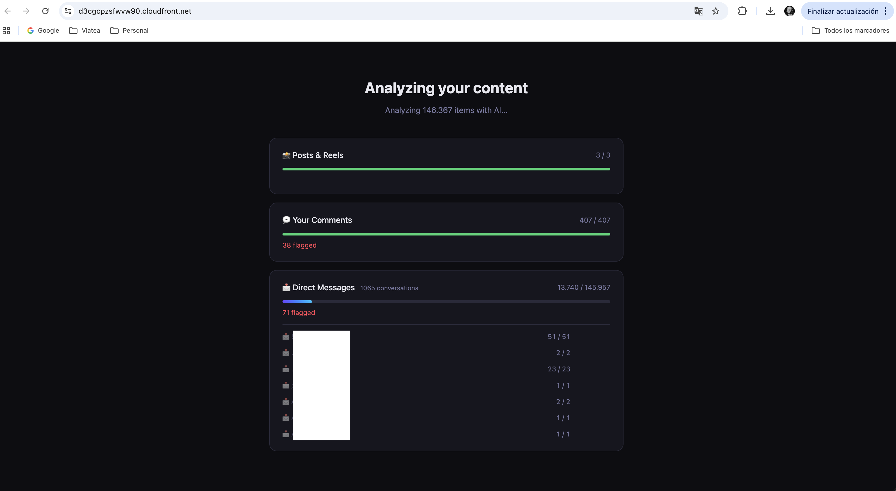
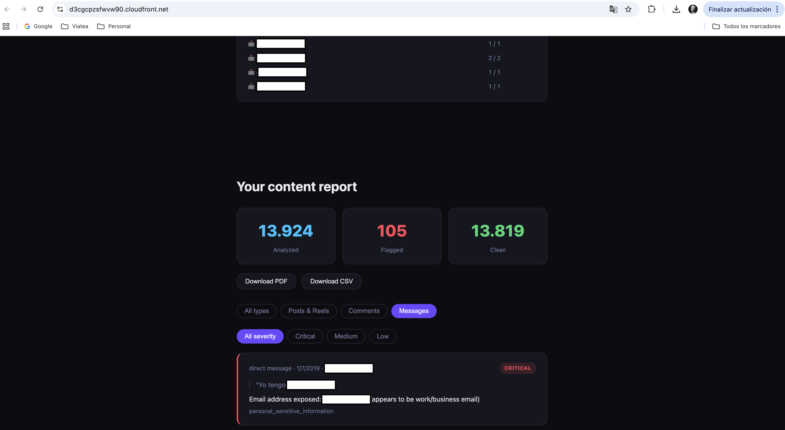

# Instagram Content Audit

Most people have years of Instagram history they've forgotten about — messages, comments, and posts that contain personal information, strong opinions, or content that could be embarrassing in a different context. If you ran for office tomorrow, would you know what's sitting in your account?

This tool scans your full Instagram export and surfaces what's there, so you know what you're carrying. Everything runs on your own AWS account; no data is stored by the application.

## Screenshots

**Analysis in progress** — 146,367 items analyzed across posts, comments, and 1,065 DM conversations in parallel, with flagged counts updating in real time.



**Content report** — flagged items sorted by severity, filterable by type and severity, with PDF and CSV export.



## Architecture

```
Browser
  │
  │  zip.js — streaming ZIP parser
  │  Media files are never loaded into memory; only JSON is read
  │
  ├─► CloudFront  (HTTPS, global CDN)
  │       │
  │       │  Lambda@Edge (Node.js 22) — viewer request
  │       │  Checks igaudit_session cookie on every request
  │       │  Redirects to /login.html if missing or invalid
  │       │  /login.html and /login-config.js are public (no auth required)
  │       ▼
  │      S3  (private bucket, Origin Access Control)
  │      Static frontend: index.html · app.js · style.css · login.html
  │      config.js and login-config.js are injected by CDK at deploy time
  │
  ├─► POST /login    API Gateway → Login Lambda (Python 3.12)
  │                  Validates password, returns session token
  │                  CORS restricted to the CloudFront origin only
  │
  └─► POST /analyze  API Gateway → Analyzer Lambda (Python 3.12)
      (API key req.)              256 MB · 60 s timeout · X-Ray tracing
                                  ↓
                              Bedrock  (Claude Haiku 4.5)
                              Cross-region inference profile
                              us.anthropic.claude-haiku-4-5-20251001-v1:0
                              Prompt caching on system prompts (cache_control: ephemeral)

                              Two analysis modes:
                              ├─ Batch       posts & comments — 15 items per call
                              └─ Conversation DMs — 1 000-message sliding window
                                              + rolling summary for continuity
```

**AWS services:** S3 · CloudFront · Lambda · Lambda@Edge · API Gateway · Bedrock · IAM · CloudWatch · X-Ray · CDK (TypeScript)

## Security design

The entire stack is configured with a single value: `edgePassword`.

At CDK synth time, a session token is derived:
```
sessionToken = HMAC-SHA256(edgePassword, "igaudit-session")
```

This token is used in three places:
1. **Lambda@Edge** — the expected value for the `igaudit_session` cookie
2. **Login Lambda** — returned to the browser after a correct password is entered
3. **API Gateway key** — the value of the API key required on `POST /analyze`

The browser reads the token from the cookie and sends it as the `x-api-key` header. The key is never written to any file in the repository.

## Features

**Analysis**
- Detects which account is yours (the sender appearing in the most conversations) and only flags your own messages, using the full conversation as context
- Unanswered contact detection: flags conversations where you sent messages with no reply (high: 5+, medium: 3–4, low: 2)
- Batch mode for posts and comments (15 items per Bedrock call)
- Sliding-window conversation mode for DMs (1 000 messages per call with a rolling summary passed between windows)
- 5 DM conversations analyzed in parallel to reduce total runtime

**Frontend**
- Streaming ZIP parser — photos and videos are skipped entirely; only JSON files are read
- Live results appear sorted by severity as analysis runs (no waiting for the full scan)
- Filter results by content type (Posts & Reels / Comments / Messages) and severity (Critical / Medium / Low)
- Cost estimate shown before analysis starts
- Browser notification + sound when the scan finishes (works while the tab is minimized)
- Results cached in localStorage for 48 hours — refreshing the page restores the report without re-running
- PDF export (jsPDF, loaded lazily — does not affect page load time; generated locally, nothing sent externally)
- CSV export (UTF-8 BOM, opens correctly in Excel)

**Observability**
- X-Ray active tracing on both Lambdas (Analyzer and Login)
- CloudWatch alarm: fires when the Analyzer Lambda logs ≥ 5 errors in a 5-minute window

## Deploy

### Prerequisites

- Node.js 18+
- AWS CLI configured (`aws configure sso` or `aws configure`)
- CDK CLI: `npm install -g aws-cdk`
- Bedrock model access enabled for `us.anthropic.claude-haiku-4-5-20251001-v1:0` in `us-east-1`
  → AWS Console → Bedrock → Model access → Request access for Claude Haiku 4.5

> **Region:** the stack must be deployed to `us-east-1`. Lambda@Edge functions are required to live in us-east-1 regardless of where CloudFront serves traffic.

### Steps

```bash
cd infrastructure
npm install

# First deploy only — bootstraps the CDK staging bucket
AWS_PROFILE=your-profile cdk bootstrap --context edgePassword=YOUR_PASSWORD

# Deploy
AWS_PROFILE=your-profile cdk deploy --context edgePassword=YOUR_PASSWORD
```

`YOUR_PASSWORD` is the password you will use to log in to the app. It is passed only as a CLI argument and is never written to any file.

CDK outputs two values:
```
InstagramModeratorStack.CloudFrontURL = https://xxxx.cloudfront.net   ← open this in your browser
InstagramModeratorStack.ApiGatewayURL = https://xxxx.execute-api.us-east-1.amazonaws.com/prod/
```

`config.js` and `login-config.js` are generated automatically by CDK with the correct API URLs and deployed to S3. You do not need to edit them manually.

### Updating after code changes

```bash
AWS_PROFILE=your-profile cdk deploy --context edgePassword=YOUR_PASSWORD
```

CDK computes a diff and only updates the resources that changed.

### Tear down

```bash
AWS_PROFILE=your-profile cdk destroy --context edgePassword=YOUR_PASSWORD
```

The S3 bucket and all its contents are deleted automatically (`RemovalPolicy.DESTROY` + `autoDeleteObjects`).

## Getting your Instagram data

1. Instagram → **Settings** → **Your activity on Instagram** → **Download your information**
2. Select **JSON** format and request the download
3. Instagram will email you a link within 48 hours
4. Upload the `.zip` directly to the app — no need to unzip

## Cost estimate

All charges go to your own AWS account.

| Service | Cost |
|---|---|
| Bedrock — Claude Haiku 4.5 | $0.25 / 1M input tokens · $1.25 / 1M output tokens |
| Lambda (Analyzer + Login) | First 1M requests / month free |
| Lambda@Edge | First 1M requests / month free |
| API Gateway | First 1M calls / month free |
| CloudFront + S3 | Fractions of a cent per request |
| CloudWatch alarm | $0.10 / alarm / month |
| X-Ray | First 100K traces / month free |

A typical personal account (150 000 DM messages + 500 comments + a few posts) costs **under $2** for a full scan, assuming the free tiers above apply.
